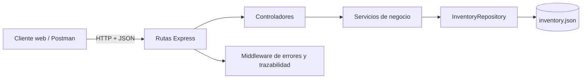
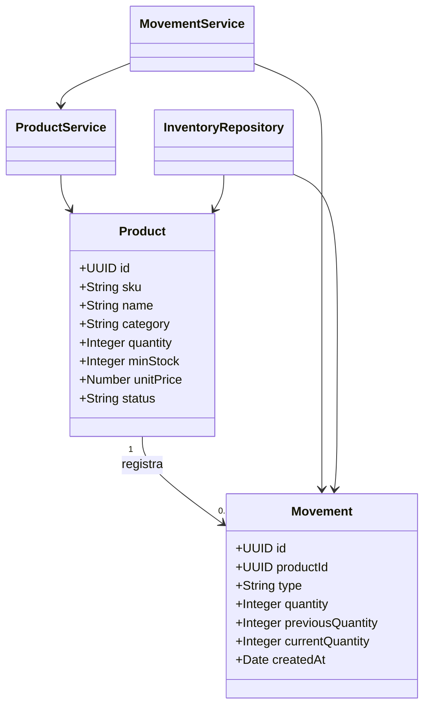
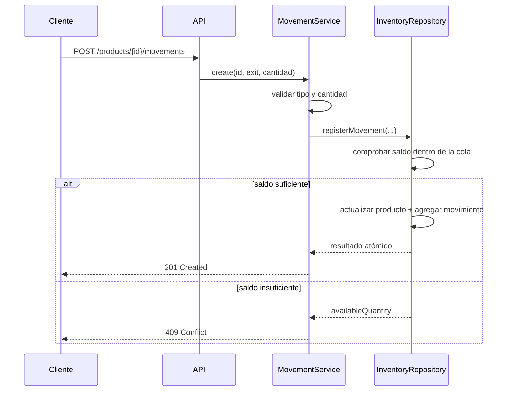

# Informe técnico — diseño y desarrollo de servicios web

## 1. Identificación

| Campo | Valor |
|---|---|
| Evidencia | GA7-220501096-AA5-EV03 |
| Aprendiz | Andres Felipe Avendaño Lopez |
| Ficha | 3235904 |
| Programa | Análisis y Desarrollo de Software |
| Sistema | StockFlow |
| Módulo | Productos y movimientos de inventario |

## 2. Objetivo y alcance

Diseñar, codificar, documentar y probar servicios web REST que permitan a una pequeña empresa administrar su catálogo y controlar las existencias de StockFlow. El incremento cubre productos, filtros, resumen, categorías y movimientos de entrada/salida. La autenticación, los proveedores y las órdenes comerciales quedan fuera porque no forman parte del alcance funcional disponible.

## 3. Requisitos funcionales

| Código | Requisito | Servicios relacionados |
|---|---|---|
| RF-01 | Registrar y consultar productos | `POST/GET /products` |
| RF-02 | Modificar y eliminar productos | `PUT/PATCH/DELETE /products/{id}` |
| RF-03 | Buscar y filtrar el catálogo | `GET /products?q=&category=&status=` |
| RF-04 | Consultar alertas e indicadores | `GET /products/summary` |
| RF-05 | Consultar categorías existentes | `GET /products/categories` |
| RF-06 | Registrar entradas y salidas | `POST /products/{id}/movements` |
| RF-07 | Consultar trazabilidad de movimientos | `GET /movements` y ruta por producto |
| RF-08 | Comprobar disponibilidad | `GET /health` |

## 4. Historias de usuario

- **HU-01:** Como administrador quiero mantener el catálogo de productos para disponer de información actualizada.
- **HU-02:** Como encargado de bodega quiero registrar entradas y salidas para conservar un saldo confiable.
- **HU-03:** Como administrador quiero consultar alertas y el valor del inventario para apoyar decisiones.
- **HU-04:** Como auditor quiero revisar el historial por producto y fecha para rastrear cambios.

## 5. Diseño de arquitectura

La solución usa arquitectura por capas y dependencias dirigidas hacia las reglas de negocio.

- **Rutas:** definen recursos, métodos y versión `/api/v1`.
- **Controladores:** convierten solicitudes en invocaciones de servicio y asignan códigos HTTP.
- **Servicios:** validan datos, calculan estados, protegen el saldo y generan identificadores.
- **Repositorio:** persiste productos y movimientos como una unidad atómica.
- **Middleware:** agrega identificador de solicitud, cabeceras defensivas y respuestas de error uniformes.

## 6. Modelo de dominio

## 7. Flujo crítico: salida de inventario

## 8. Decisiones de diseño REST

- Recursos expresados como sustantivos plurales: `products` y `movements`.
- Métodos HTTP según intención: GET consulta, POST creación, PUT/PATCH actualización y DELETE eliminación.
- URI versionada para permitir cambios futuros sin romper clientes existentes.
- Códigos HTTP diferenciados para validación, ausencia y conflictos de negocio.
- OpenAPI 3.0 como contrato independiente de la implementación.
- JSON uniforme y fechas ISO 8601.

## 9. Persistencia e integridad

El archivo `data/inventory.json` contiene `{ products, movements }`. El repositorio serializa mutaciones mediante una cola de promesas, escribe primero un archivo temporal y luego lo renombra. Producto y movimiento se guardan juntos, evitando que un cambio de saldo quede sin historial. La capa puede sustituirse por PostgreSQL o MySQL sin cambiar rutas ni controladores.

## 10. Seguridad y calidad

- Límite de cuerpo JSON de 100 KB.
- Cabeceras `X-Content-Type-Options`, `X-Frame-Options` y `Referrer-Policy`.
- Ocultamiento de `X-Powered-By`.
- Escape de contenido dinámico en la interfaz.
- Validación en servidor, independiente del cliente.
- Identificador `X-Request-Id` por solicitud.
- Mensajes internos no expuestos en errores 500.
- ESLint y pruebas automatizadas.

Para producción se recomienda añadir autenticación, HTTPS, control de permisos, límites por IP, base de datos transaccional y gestión de secretos.

## 11. Estrategia de pruebas

| Nivel | Cobertura |
|---|---|
| Unitaria | SKU, validaciones, estados, resumen, entradas y salidas |
| Integración | Rutas, códigos 200/201/204/404/409/422 y persistencia temporal |
| Estática | Reglas de ESLint en servidor, pruebas y navegador |
| Manual | Colección Postman, archivo HTTP y catálogo visual |

Casos prioritarios: producto válido, SKU duplicado, datos inválidos, salida superior al saldo, actualización del resumen, filtros y ruta inexistente.

## 12. Matriz de trazabilidad

| Requisito | Implementación | Prueba | Documento |
|---|---|---|---|
| RF-01 | ProductService / productRoutes | ProductService + Api | OpenAPI `products` |
| RF-02 | ProductController | ProductService + Api | Servicios 4.4–4.6 |
| RF-03 | ProductService.list | ProductService | Servicio 4.2 |
| RF-04 | ProductService.getSummary | ProductService + Api | Servicio 4.7 |
| RF-05 | ProductService.getCategories | Api | Servicio 4.8 |
| RF-06 | MovementService.create | MovementService + Api | Servicio 4.9 |
| RF-07 | MovementService.list | MovementService + Api | Servicios 4.10–4.11 |
| RF-08 | app.js | Api | Servicio 4.1 |

## 13. Versionamiento

El proyecto se inicializa con Git sobre la rama `main`. `.gitignore` excluye dependencias, archivos temporales, registros y variables de entorno. `docs/GUIA_VERSIONAMIENTO.md` explica cómo crear el remoto y actualizar `ENLACE_REPOSITORIO.txt`.

## 14. Conclusión

StockFlow API cumple el alcance mediante servicios REST ejecutables, contrato OpenAPI, catálogo visual, ejemplos de consumo, pruebas y repositorio Git. La separación de capas y el modelo de errores facilitan mantenimiento, sustitución de persistencia y ampliación del proyecto formativo.
